# 系统设计文档

（重点展示系统架构以及特定技术关键点的技术解决方案）

## 1. 技术选型

在设计《恶魔轮盘》网页游戏时，我们考虑了游戏的业务功能和性能需求，以及开发人员掌握的技术和经验。以下是我们选择开发平台和特定开发框架或产品的考虑因素：

### 1.1 开发平台选择

我们的目标是开发一款网页游戏，能够在浏览器中流畅运行，并支持双人对战功能，因此我们选择了基于Web技术的开发平台。

**Web技术的优势：**

1. **跨平台性：** 可以在各种操作系统和设备上运行，包括桌面电脑、平板电脑和手机等。

2. **无需安装：** 用户无需安装任何额外的应用程序，只需通过浏览器即可访问游戏。

3. **实时通信：** 可以利用WebSocket等技术实现双人对战的实时通信功能。

4. **交互性：** 能够提供丰富的用户交互体验，包括拖拽、点击等操作。

### 1.2 前端框架选择 (Vue.js)

由于游戏需要复杂的用户界面和交互逻辑，我们选择了Vue.js作为前端开发框架。

Vue.js的优势：

1. **响应式设计：** 能够快速响应用户操作，实现动态更新页面内容。

2. **组件化开发：** 支持组件化开发模式，便于代码复用和维护。

3. **生态丰富：** 拥有庞大的社区和丰富的插件，能够满足各种需求。

### 1.3 后端语言与技术栈选择（Rust + tokio）

考虑到游戏需要处理复杂的游戏逻辑和实现双人对战功能，我们选择了Rust作为后端语言。

负责后端开发的小组成员曾经将以下语言列入考虑：

- **C++**
  - 优势：系统级编程语言，性能可以做到极高
  - 劣势：(除了性能之外几乎全是劣势)
    - 学习成本高
    - 构建系统复杂（cmake），没有通用的包管理工具
    - 开发效率低
    - 非常容易写出内存、多线程相关bug
    - 标准库对并发的支持并不完善
      - C++20标准的`<coroutine>`库提供的协程原语过于低级，难以使用
      - `<thread>`与`<jthread>`库提供的多线程操作，较难使用，且在使用时容易出现bug
      - `<executors>`库在2024年才迟迟进入C++26标准草案，编译器支持有限
- **Golang**
  - 优势：
    - 语法简洁、设计良好，易于学习，开发效率高
    - 性能不错
    - 语言设计上易于开发高并发服务器
  - 劣势：语言表达力有限
- **Rust**
  - 优势：
    - 系统级编程语言，性能可媲美 C/C++
    - 语言设计良好：编译期保证**内存安全与并发安全**，语言表达力强，具有大量现代编程语言特性
    - **构建系统与包管理系统易于使用**
    - 原生支持async语法，易于实现并发操作。
  - 劣势：学习曲线陡峭

**出于以下原因，我们最终选择了Rust作为后端开发语言：**

1. **性能优异：** Rust具有高性能和低内存占用的特性，能够满足游戏对性能的要求。

2. **安全性高：** Rust具有严格的编译时检查，能够有效防止内存安全问题和线程安全问题。

3. **并发性好：** Rust拥有性能优异易于使用的异步运行时 tokio，能够以更高层抽象的方式编写并发代码

4. 对 Rust 的偏好，希望借此机会熟悉 Rust 语言

通过以上技术选型，我们将能够高效地开发出一款性能优异、用户体验良好的《恶魔轮盘》网页版游戏，并实现游戏的核心功能，包括卡牌抽取、道具使用、决策制定和双人对战等。

### 1.4 前后端通信方式选择 （WebSocket）

- TCP 长连接：
  - 优点：可靠性、全双工协议、开源支持多、应用较广泛、面向连接、研发成本低、报文内容不限制
  - 缺点：
    - 操作系统：较耗内存，支持连接数有限
    - 设计：协议复杂，需要自定义应用层协议
    - 网络：网络差情况下延迟较高
    - 传输：效率低于UDP协议
- UDP：
  - 优点：并发高，内存消耗较低、传输效率高，网络延迟低、传输模型简单
  - 缺点：
    - 协议：不可靠、单向协议、开源支持少、报文内容有限，不能大于1464bytes
    - 设计：协议设计复杂
    - 网络：可能有数据报文丢失的情况
- HTTP 短链接（RESTful）：
  - 优点：协议较成熟，应用广泛、基于TCP/IP，拥有TCP优点、研发成本很低，开发快速、开源软件较多，nginx,apache,tomact等
  - 缺点：无状态无连接、只有PULL模式，不支持PUSH、数据报文较大
  - 特性：基于TCP/IP应用层协议、无状态，无连接（短链接）、支持C/S模式、适用于文本传输
- WebSocket：
  - 优点：协议较成熟、基于TCP/IP，拥有TCP优点、数据报文较小，包头非常小、面向连接，有状态协议、开源较多，开发较快
  - 缺点：websocket是应用层协议，所以数据包不简洁，相比于tcp，更耗流量与性能
  - 特性：有状态，面向连接、数据报头较小、适用于WEB3.0以及其他即时联网通讯、长链接

对上述协议特性进行分析，结合不同游戏类型的特性，可以得到：

1. 对于弱联网类游戏，比如单机、消除类的游戏，可以HTTP协议，考虑安全的话使用HTTPS，或者对内容做对称加密。
2. 对于实时性，交互性要求较高的游戏，可以考虑TCP与websocket协议；TCP相对性能更好，但是更难开发。
3. 对于实时性要求极高，且可达性要求一般的游戏，可以选择UDP协议；
4. 局域网对战类，赛车类等强实时性游戏，需要用UDP协议

**考虑到我们的需求是一个卡牌式在线对战游戏，需要一定的实时性，对性能没有很高要求，并且要求相关技术栈易于学习与开发，因此我们选择WebSocket作为前后端通信手段，在其之上通过json数据格式传输消息。**

## 2. 系统总体架构

（2）使用组件图、部署图给出系统总体架构概貌。
	系统将生成多少个组件（比如.jar包，dll，JavaScript模块，Vue/Angular/React组件……），各组件中主要包容哪些类？划分依赖是什么？有哪些需要特别指出的地方吗？
	这些组件如何部署？
哪些放在Server端，哪些放在Client端，使用几台服务器，每台服务器上部署哪些组件？
采用的是单体应用还是微服务？服务边界是如何确定的？服务之间的交互如何实现？
系统是人工部署还是自动部署？
如何解决版本升级及演化问题？
如何解决系统可伸缩性问题？
……

### 2.1 客户端组件

客户端组件的划分依据是游戏中需要跳转的不同界面，例如开始游戏界面可以跳转到匹配界面，匹配成功后跳转到游戏界面进行游戏，游戏结束后跳转到结束游戏界面。

**Vue组件：**

1. **StartGame.vue：**开始游戏界面组件，包含开始游戏按钮等。

2. **MatchPage.vue：**匹配界面组件，显示输入房间号的文本框，加入房间、退出房间等按钮。

3. **GamePage.vue：**游戏界面组件，展示游戏主要内容，包括卡牌、玩家信息、可操作性的按钮等。

4. **EndGame.vue：**结束游戏界面组件，展示游戏结果和结算信息，包含返回游戏开始界面按钮和退出游戏按钮。

**架构模式：**单体应用架构。由于游戏规模相对较小，采用单体应用架构可以简化开发和部署过程，降低系统复杂度。

**部署方案：**目前本系统为人工部署，未来完善过程中，可以采用自动化部署工具，如Jenkins、Ansible等进行自动化部署，提高部署效率和可靠性。

**服务交互：**客户端通过WebSocket与服务端进行通信，实现实时游戏数据的传输和同步。

**版本升级及演化：**可以采用持续集成和持续部署（CI/CD）的方式，通过自动化测试和部署流程实现版本的快速迭代和更新。

**系统可伸缩性：**未来完善过程中，可以通过水平扩展的方式实现系统的可伸缩性，根据需求增加服务器节点来应对用户量的增长。利用负载均衡技术，如Nginx的负载均衡模块，来均衡请求流量，提高系统的稳定性和性能。

### 2.2 服务端组件

1. Connection: 含有一个存储向用户发送消息的队列。生成两个task：第一个用于接收用户的websocket通信，内部while loop 异步等待消息传入，并将json payload转换为后端内部的Event类型，发送到Lobby或游戏房间的消息队列里；另一个用于向用户发送消息，也是内部while loop 异步等待消息需要发送的消息，将Event转换为json payload；

2. Lobby，含有一个LobbyEvent消息多生产者单消费者队列，有一个task，内部while loop异步等待消息，并根据消息内容，进行游戏房间实例的创建与销毁。

3. GameRoom，含有一个GameEvent消息多生产者单消费者队列，有一个task，内部while loop异步等待消息，并根据消息内容，进行游戏逻辑状态机的处理与变化，并将结果消息Event发送给Connection，由其向玩家发送。

4. GameState，游戏状态机，根据游戏逻辑，处理游戏状态的变化，包括玩家的操作、卡牌的抽取、游戏结果的判定等。

### 2.3 前后端通信

## 3. 解决方案

（3）选取本系统中的几个技术关键点，描述你们的解决方案，可通过类图、顺序图等介绍

**后端内部的分层解耦**

分为网络连接层，房间管理层，房间行为层， 游戏逻辑状态机层。层与层之间解耦。

1. 网络连接层 Connection: 含有一个存储向用户发送消息的队列。生成两个task：第一个用于接收用户的websocket通信，内部while loop 异步等待消息传入，并将json payload转换为后端内部的Event类型，发送到Lobby或游戏房间的消息队列里；另一个用于向用户发送消息，也是内部while loop 异步等待消息需要发送的消息，将Event转换为json payload；

2. 房间管理层 Lobby，含有一个LobbyEvent消息多生产者单消费者队列，有一个task，内部while loop异步等待消息，并根据消息内容，进行游戏房间实例的创建与销毁。

3. 房间行为层 GameRoom，含有一个GameEvent消息多生产者单消费者队列，有一个task，内部while loop异步等待消息，并根据消息内容，进行游戏逻辑状态机的处理与变化，并将结果消息Event发送给Connection，由其向玩家发送。

4. 游戏逻辑状态机层 GameState，游戏状态机，根据游戏逻辑，处理游戏状态的变化，包括玩家的操作、卡牌的抽取、游戏结果的判定等。

